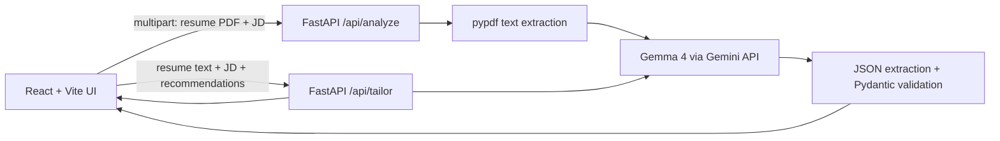

# ResumePilot — AI Job Application Copilot

Upload a resume PDF, paste a job description, and get an AI-assisted compatibility analysis, evidence-based tailoring recommendations, and a tailored resume draft — powered by **Gemma 4**.

Built for the **Hacktoberfest 2026 DEV "Build for a Friend"** challenge.

## Problem
A friend applying to many internships has to manually compare their resume with every job description, spot gaps, and rewrite bullets each time. It is slow, and under time pressure it is tempting to over-claim.

## Why I built it
To give job seekers a fast second opinion that explains *why* each change is suggested, while refusing to invent skills, projects, metrics or titles.

## Features
- PDF resume upload with text extraction (pypdf); nothing is stored on disk or in a database
- Job description via paste, or optional PDF/TXT file
- Structured profile extraction for resume and JD (only what is present)
- Compatibility dashboard: overall, skills, experience, projects, education
- Strong matches, missing skills, weak areas, keyword coverage (matched / missing / weak)
- Recommendations that each explain WHY, with a "Verify before adding" label where the resume does not prove a claim
- Tailored resume draft (rewrite / reorder / emphasize only), TXT download and Print-to-PDF
- Error handling: invalid/empty/scanned PDF, empty JD, bad API key, quota, timeout, malformed JSON (parse → extract → one model repair retry)

> The scores are an **AI-assisted compatibility estimate**, not an official ATS score and not scientifically validated.

## Architecture



## Tech stack
React, Vite, Tailwind CSS 3 · Python, FastAPI, Pydantic, pypdf · `google-genai` SDK · Gemma 4 (`gemma-4-26b-a4b-it`)

## How Gemma 4 is used
1. `/api/analyze` sends the extracted resume text and JD to Gemma 4 with strict rules (no invention, JD/resume treated as untrusted data) and asks for one JSON object containing resume profile, JD profile and analysis.
2. The backend extracts the JSON from the reply, validates and clamps it with Pydantic, derives keyword coverage, and returns only the validated structure — never raw model output.
3. `/api/tailor` asks Gemma 4 for a rewritten resume plus a change list and a "verify" list, constrained to facts in the original resume.

The API key lives only in the backend `.env`; the React app never sees it.

## Why Gemma / Open Innovation?
- Gemma is an **open-weight** model.
- It gives the project a model that can be changed, experimented with and run in different environments.
- For this prototype, the hosted Gemini API provides convenient access to Gemma without requiring users to download a large model or own a capable GPU.
- This makes experimentation practical within a weekend.
- The project deliberately avoids proprietary closed models for the core AI reasoning.

**Important:** this project uses Gemma through a **hosted API, not local inference**.

## Why open-weight AI matters
Open weights let developers inspect, adapt, benchmark and self-host a model. The same prompts and app could later point at a self-hosted Gemma deployment if you want to change where inference happens.

## Privacy considerations
Because Gemma is accessed through a hosted API, **your resume text and the job description are sent to the selected API provider for inference.** The app does not write uploads to disk or a database, but it does not make the data local. Review the provider's terms before uploading anything confidential. The UI shows: *"Your resume is processed through Gemma 4 using the configured Gemini API service. Do not upload confidential information you are not comfortable sending to the API provider."*

## Setup
Requirements: Python 3.10+, Node 18+.

### Gemini API key (Google AI Studio)
1. Open https://aistudio.google.com/apikey and sign in.
2. Click **Create API key**, and copy it.
3. `cp .env.example backend/.env` and set `GEMINI_API_KEY=...`.

### Environment variables
| Name | Purpose | Default |
|---|---|---|
| `GEMINI_API_KEY` | Google AI Studio key (required) | — |
| `GEMMA_MODEL` | Gemma 4 model id on the Gemini API | `gemma-4-26b-a4b-it` |
| `GEMMA_TIMEOUT_SECONDS` | Request timeout | `90` |

Check the [Gemma on Gemini API docs](https://ai.google.dev/gemma/docs/core/gemma_on_gemini_api) if a model id changes, and your AI Studio quota/pricing for current limits.

### Run the backend
```bash
cd backend
python -m venv .venv
source .venv/bin/activate        # Windows: .venv\Scripts\activate
pip install -r requirements.txt
uvicorn main:app --reload --port 8000
```

### Run the frontend (new terminal)
```bash
cd frontend
npm install
npm run dev
```
Open http://localhost:5173 (Vite proxies `/api` to the backend).

## Example usage
1. Click **Load sample data** (or upload `sample/sample_resume.pdf` and paste `sample/sample_job_description.txt`).
2. Click **Analyze Resume**, review the dashboard and recommendations.
3. Click **Generate Tailored Resume**, review it, then download TXT or Print/Save as PDF.

API directly:
```bash
curl -F "resume=@sample/sample_resume.pdf" -F "jd_text=$(cat sample/sample_job_description.txt)" http://127.0.0.1:8000/api/analyze
```

## Tests
```bash
cd backend
pip install -r requirements-dev.txt
pytest -q          # mocks Gemma: PDF extraction, JSON parsing/repair, validation, errors
```
Live check (needs a real key): run both servers and use the sample data flow above.

## Screenshots
_Add screenshots here: `docs/dashboard.png`, `docs/tailored-resume.png`_

## Future improvements
DOCX resume support, side-by-side diff of original vs tailored, per-JD history (opt-in, local), self-hosted Gemma option, streaming responses.
